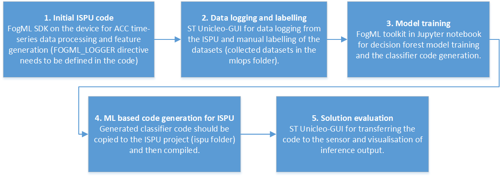

# FogML-ISPU

The repository contains the simple code for the classifier running directly on the accelerometer/gyroscope sensor. The code is for the ST ISM330IS sensor, which is equipped with a tiny processing core—a 5/10MHz clock, 32kB of program RAM, 8kB of data RAM, and an FPU.

In the example, the FogML toolkit for TinyML is used - https://github.com/tszydlo/FogML

The code in the example is intended to recognize simple 3D movement patterns in the air:

The content of the repository is as follows:
 - docs - images etc.
 - ispu - source code of the example with FogML library and the configured processing pipeline i.e. windowing, DSP, classifier.
 - mlops - Jupiter notebook for training classifier and the the source code generation
 - output-logger - precompiled code for the ISPU for data logging
 - output-classifier - final example code for the ISPU

The process of creating the final solution comprises the five steps as presented in the figure.

To program the sensor with ISPU, follow the  ST ISPU product page tutorial.
