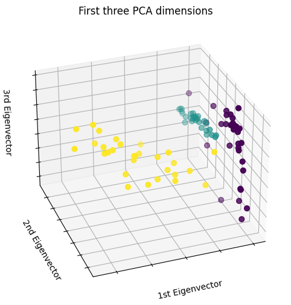
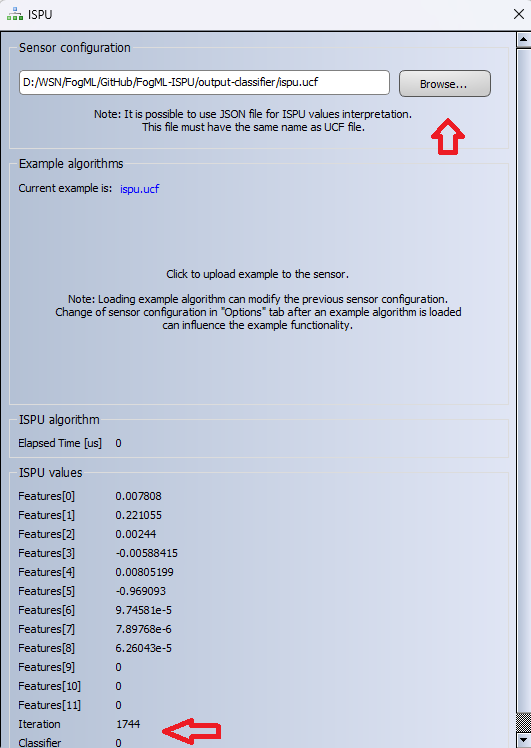

# FogML-ISPU

The repository contains the simple code for the classifier running directly on the accelerometer/gyroscope sensor. The code is for the ST ISM330IS sensor, which is equipped with a tiny processing core—a 5/10MHz clock, 32kB of program RAM, 8kB of data RAM, and an FPU.

In the example, the FogML toolkit for TinyML is used - https://github.com/tszydlo/FogML

The code in the example is intended to recognize simple 3D movement patterns in the air:


The content of the repository is as follows:
 - `docs` - images etc.
 - `ispu` - source code of the example with FogML library and the configured processing pipeline i.e. windowing, DSP, classifier.
 - `mlops` - Jupiter notebook for training classifier and the source code generation
 - `output-logger` - precompiled code for the ISPU for data logging
 - `output-classifier` - final example code for the ISPU

The process of creating the final solution comprises the five steps as presented in the figure.


For the data logging, the ST Unicleo-GUI can be used as presented in the figure:


In the `mlops` folder there are datasets for each of the movement pattern classes - `idle`, `snake` and `circle`. Each of them has the following format:
```
#Format version: 1.0
time[us],accX[mg],accY[mg],accZ[mg],gyroX[mdps],gyroY[mdps],gyroZ[mdps],magnX[mG],magnY[mG],magnZ[mG],press[hPa],temp[C],hum[%RH],newData,ISPU T [us],Features[0],Features[1],Features[2],Features[3],Features[4],Features[5],Features[6],Features[7],Features[8],Features[9],Features[10],Features[11],Iteration,
80047825580,,,,,,,,,,,,,0x218,,0.305,0.212158,3.76297,-0.258687,1.13631,0.97021,0.0868594,13.2601,0.892204,3,3,8,408,
80048817999,,,,,,,,,,,,,0x218,,0.896456,0.132501,4.87292,-0.124581,0.99796,0.910158,1.35961,59.9006,1.8892,7,11,16,409,
80049811148,,,,,,,,,,,,,0x218,,0.806664,0.0579594,4.98468,-0.2992,1.0043,0.886358,1.11116,59.628,2.02088,8,11,13,410,
80050803571,,,,,,,,,,,,,0x218,,0.70272,0.211473,4.29538,-0.0940151,1.06555,0.93102,0.834952,42.1189,1.68653,11,10,10,411,
90000665888,,,,,,,,,,,,,0x218,,0.839116,0.161772,4.84316,-0.114032,1.06408,0.916586,1.14604,53.0876,2.24843,10,9,9,412,
90001658334,,,,,,,,,,,,,0x218,,0.919636,0.0622294,5.17622,-0.188546,1.3076,0.914296,1.40072,71.986,3.61922,10,10,10,413,
```

Initial analysis shows that the classes are nicely separable.


A decision forest has been used as a classifier. For the model search, the depth of the tree has been set to 3, and various numbers of trees have been analysed. As the final classifier, 10 trees have been chosen.


The ML training code can be found in the `mlops` folder in the Jupyter Notebook. The generated `classifier.c` code has been compiled into the ISPU firmware and deployed to the accelerometer ISM330IS. The size of the final firmware is 7412 bytes.

```
   text	   data	    bss	    dec	    hex	filename
   6868	    156	    388	   7412	   1cf4	ispu.elf
```

The final evaluation can be done using the same tool - programming and the detected class notification:


To program the sensor with ISPU, follow the ST ISPU product page tutorial. Binary versions of the ISPU firmware are in the folders `output-logger` and `output-classifier`.
